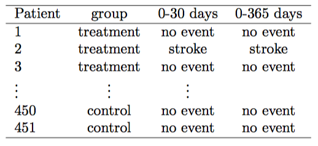

## Course Logistic

* Every Wednesday 19:00 - 21:00
* http://nikolaypavlov.github.io/da-workshops-0/
* Skype Chat: https://join.skype.com/gjN0CfAd4bhg
* Reference Book: https://www.openintro.org/stat/textbook.php
* Download R: http://www.r-project.org/
* Download R Studio: http://www.rstudio.com/
* Install the following packages: openintro
* Download R Reference Card: http://cran.r-project.org/doc/contrib/Short-refcard.pdf

---
## Topics

* R programming language
* Data, observations and variables
* Relationship between variables
* Population and sample 
* Dependent and independent variables
* Experimental design and sampling methods

---
## What is R?

* R is a free software programming language for statistical computing and graphics
* Methods include: linear and nonlinear modelling, classical statistical tests, time-series analysis, classification, clustering, etc. 
* More than 8000 packages


[16th annual KDnuggets Software Poll](http://www.kdnuggets.com/2015/05/poll-r-rapidminer-python-big-data-spark.html)

---
## R examples

R's data structures include scalars, vectors, matrices, data frames and lists.


```r
x <- c(1,2,3,4,5,6)     # Vector
y <- x^2                # Square the elements of x
print(y)                # print (vector) y
```

```
## [1]  1  4  9 16 25 36
```

```r
mean(y)                 # Calculate average (arithmetic mean) of (vector)
```

```
## [1] 15.16667
```

---
## R examples

```
help(plot)              # Documentation
```


```r
plot(x,y, type="l")     # plot x, y
```


---
## R examples


```r
head(iris)              # return the first part of the Iris data frame
```

```
##   Sepal.Length Sepal.Width Petal.Length Petal.Width Species
## 1          5.1         3.5          1.4         0.2  setosa
## 2          4.9         3.0          1.4         0.2  setosa
## 3          4.7         3.2          1.3         0.2  setosa
## 4          4.6         3.1          1.5         0.2  setosa
## 5          5.0         3.6          1.4         0.2  setosa
## 6          5.4         3.9          1.7         0.4  setosa
```

```r
var <- iris$Species     # assign Species column to var
print(iris[1,2])        # print the element of 1 row and 2 column
```

```
## [1] 3.5
```

---
## Study Design

Statistics is the study of how best to collect, analyze, and draw conclusions from data

1. Identify a question or problem.
2. Collect relevant data on the topic. 
3. Clean it and prepare dataset.
5. Analyze the data.
6. Form a conclusion.

---
## Case study: Does stent reduce the risk of stroke?



Researchers randomly assigned 224 patients to the treatment group and 227 to control. 

Descriptive Statistics


--- 
## Case study: Summary statistics

Had a stroke in the treatment group: 45/224 = 0.20 = 20%

Had a stroke in the control group: 28/227 = 0.12 = 12%

Does stent reduce the risk of stroke? 

Does the difference between the groups "real"?

---
## Observations, Variables and Data Frames


```r
library(openintro)
columns <- c('spam', 'num_char', 'line_breaks', 'format', 'number')
head(email50[, columns], n=3)
```

```
##   spam num_char line_breaks format number
## 1    0   21.705         551      1  small
## 2    0    7.011         183      1    big
## 3    1    0.631          28      0   none
```

---
## Types of Variables

### Numerical and Continuous

```r
temperature <- c(36.6, 37.23, -12.3124)
```
### Numerical and Discrete

```r
dice <- c(1,2,3,4,5,6)
```
### Categorical

```r
colors <- as.factor(c("red", "red", "blue", "gray", "yellow", "gray","blue"))
levels(colors)
```

```
## [1] "blue"   "gray"   "red"    "yellow"
```

--- 
## Exercise: email50

Take email50 dataset and classify each of the variables as continuous numerical, discrete numerical, or categorical.

Some usefull R functions:
* names() - list all variable names in DataFrame
* head(), tail() - start/end of the dataset
* str() - compactly display the structure of R object

---
## Relationships between variables

County dataset


* Is federal spending, on average, higher or lower in counties with high rates of poverty?
* If homeownership is lower than the national average in one county, will the percent of multi-unit structures in that county likely be above or below the national average?

---
## Relationships between variables


```r
plot(county$poverty, county$fed_spend, pch=16, cex=0.7, ylim=c(0,35), 
     xlab="Poverty Rate (Percent)", ylab="Federal Spending Per Capita")
```


---
## Relationships between variables


```r
plot(homeownership ~ multiunit, data=county, pch=16, cex=0.7, ylim=c(0,90), 
     xlab="Percent of Units in Multi−Unit Structures", ylab="Percent of Homeownership")
```


If two variables are not associated, then they are said to be Independent.

---
## Populations and samples

Consider the following research questions:

* What is the average mercury content in swordfish in the Atlantic Ocean?
* Does a new drug reduce the number of deaths in patients with severe heart disease?
* Over the last 5 years, what is the average number of expelled students in KNURE university?

Identify the target population and what represents an individual observations.

---
## Sampling from a population

Suppose we ask a KNURE student who happens to be in the applied math department to select several students for the study. What kind of students he might collect? Do you think his sample would be representative of all students?

### Non-response bias


---
## Sampling from a population

### Simple random sample


---
## Homework

* [Lab 0 - Introduction to R and RStudio](http://htmlpreview.github.io/?https://github.com/andrewpbray/oiLabs-base-R/blob/master/intro_to_r/intro_to_r.html)
* Skype Chat for discussions: https://join.skype.com/gjN0CfAd4bhg
* Reading: OpenIntro Statistics Chapter 1, p. 1.1 - 1.3.4
* Reference Book: https://www.openintro.org/stat/textbook.php
